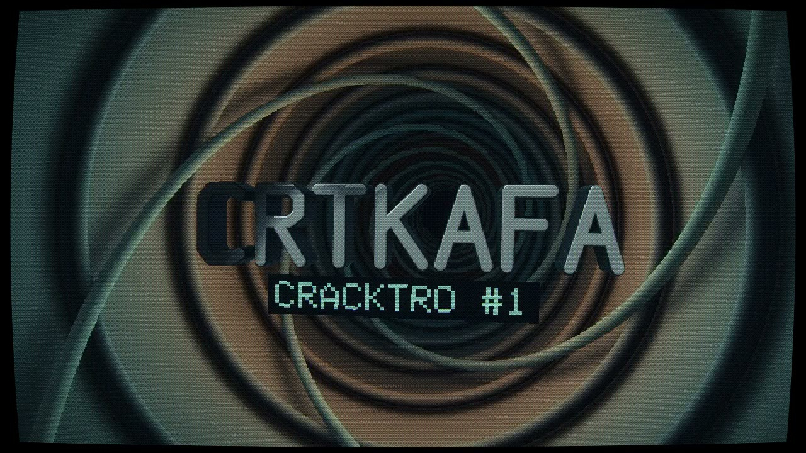

# crtkafa, cracktro #1 🐈‍⬛🌀

**2:54 · Windows x64 · Direct3D 11**

A standalone real-time demo. The music is synthesized as it runs;
shaders and model data are embedded in the executable.

## Run

Download [CRTkafa.exe](https://github.com/CRTkafa/cracktro-1/releases/download/v1.0.0/CRTkafa.exe)
from the [release](https://github.com/CRTkafa/cracktro-1/releases/tag/v1.0.0).
No installation, archive extraction, or companion assets needed.

| Key | Action |
| --- | --- |
| **F** | Fullscreen / windowed |
| **ESC** | Quit |
| **G** | Cycle flash intensity: reduced / disabled / full |

Starts fullscreen. Losing focus or dragging/resizing pauses sound and picture
together. The sequence ends; it does not loop.

Windows 10/11, 64-bit. Requires Direct3D feature level 11.0. A Windows WARP
software fallback is available, but may be slow.

**Contains flashing lights and moving high-contrast patterns.** Reduced flash
settings do not remove every high-contrast or moving element.

## Files

Release downloads are separate files, not a ZIP:

- **CRTkafa.exe** — the demo.
- **CRTkafa.nfo** — ASCII artwork and release information. Open in a monospace font.
- **RUNME.txt** — controls, requirements and playback notes.
- **CREDITS.md** — model creators, licenses and modifications.

This repository contains release documentation. Source code is not included.
Model data comes from the creators listed in [CREDITS.md](CREDITS.md);
please retain their attribution when redistributing.

Release checks cover silent rendering, audio measurements and complete video
decoding. Interactive window/audio playback and a listening-based mix review
have not been verified.

---

[crt.fyi](https://crt.fyi) · [hi@crt.fyi](mailto:hi@crt.fyi)
